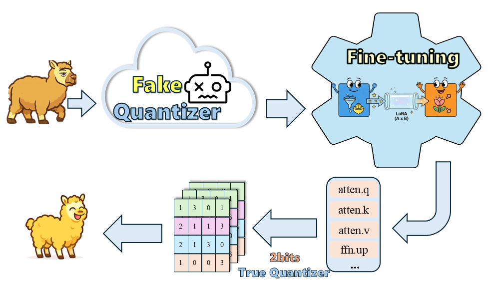
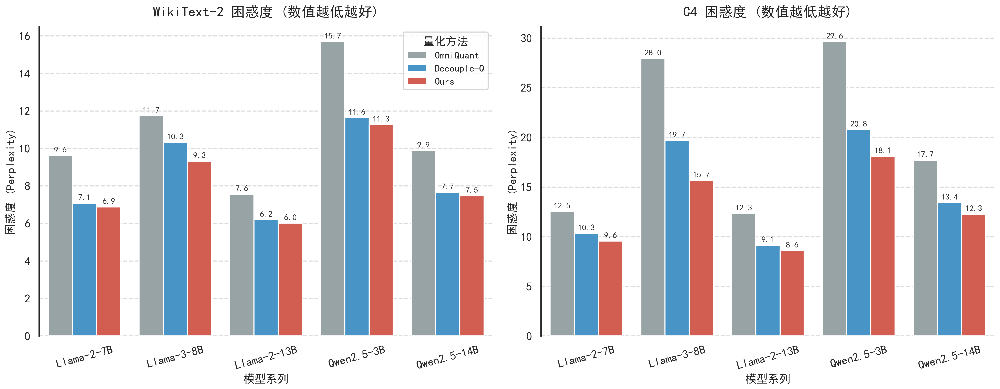
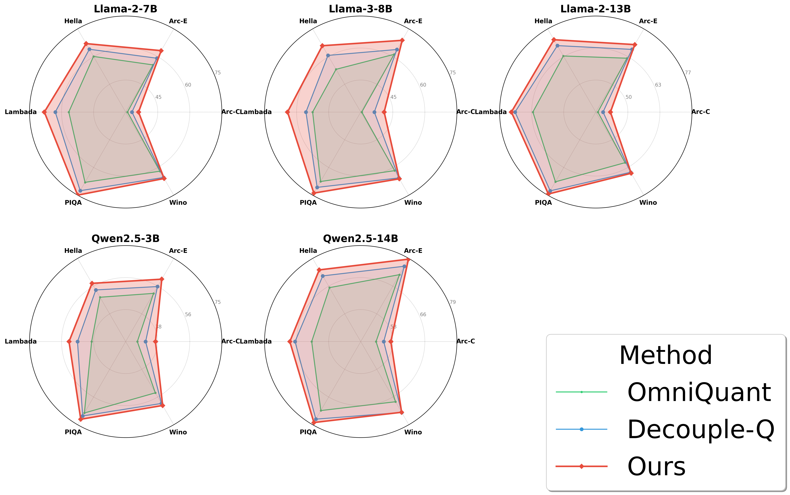
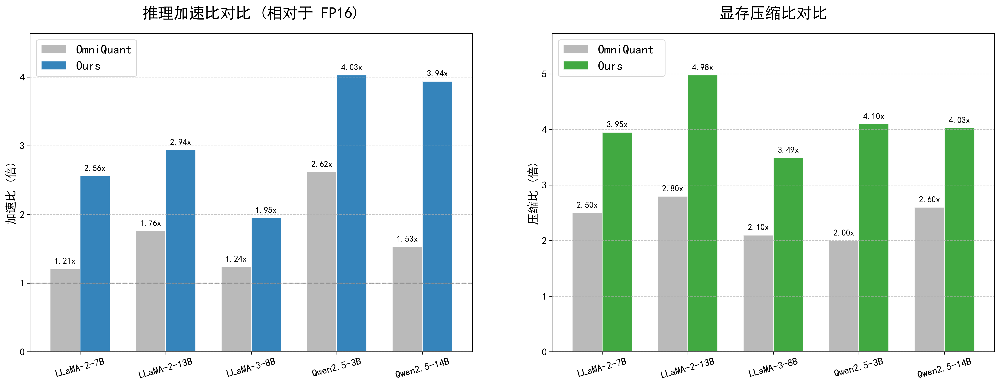

<div align="center">

# 🚀 2-Bits-Quantization
### 面向端侧部署的大模型二比特压缩技术及应用 (W2A16)

[](https://www.python.org/)
[](https://developer.nvidia.com/cuda-toolkit)
[](https://www.openkylin.top/)
[](./LICENSE)

<br/>

<br/>

<p align="center">
  <a href="#-简介-introduction">📖 简介</a> •
  <a href="#-支持模型-supported-models">📊 支持模型</a> •
  <a href="#-安装指南-installation">🛠️ 环境安装</a> •
  <a href="#-快速开始-quick-start">⚡ 快速开始</a> •
  <a href="#-实验结果-experiment-results">📈 实验结果</a> •
  <a href="#-web交互-web-demo">🌐 Web 交互</a>
</p>

</div>

---

## 📖 简介 Introduction

> **💎 打破低比特量化的精度魔咒，实现真正的 W2A16 端侧推理。**

本项目致力于解决大规模语言模型（LLM）在端侧设备部署时的存储与计算瓶颈。通过采用极低比特的 **2-bit Quantization** 技术，结合创新的量化感知算法与多域优化策略，我们成功在大幅压缩模型体积的同时，保持了模型的推理精度。

与现有的混合精度方案（如 PB-LLM, BiLLM）不同，本项目实现了**原生的 2-bit 权重与 16-bit 激活（$W2A16$）**。配合基于 **CUTLASS** 定制的高性能算子，不仅实现了真量化推理（True Quantization），更在实际部署中显著降低了显存占用并提升了推理速度。

### 🌟 核心亮点 Key Features

* **📦 极致压缩**：通过 $W2A16$ 量化，将模型体积压缩至极限，适应受限边缘设备。
* **🎯 精度保持**：采用多域优化量化算法，有效缓解低比特导致的精度崩塌问题。
* **🚀 高效推理**：内置定制化 **CUDA Kernel**，拒绝模拟量化，实打实的性能提升。
* **🔌 易于集成**：优雅的 API 设计，支持链式调用与插件扩展，对开发者友好。

---

## 📊 支持模型 Supported Models

我们目前支持以下主流开源大模型系列：

| 模型系列 (Family) | 变体 (Variants) | 状态 (Status) | 备注 |
| :--- | :--- | :---: | :--- |
| 🦙 **LLaMA-2** | 7B, 13B, 70B | ✅ Ready | 经典基座 |
| 🦙 **LLaMA-3** | 8B, 70B | ✅ Ready | 最新一代 |
| 🤖 **Qwen-2.5** | 7B, 14B, 32B... | ✅ Ready | 中文能力强 |
| 🌪️ **Mistral** | 7B, 8x7B | ✅ Ready | 高性价比 |

---

## 🛠️ 安装指南 Installation

### 1. 环境准备 (Prerequisites)

请确保您的物理环境满足以下要求：
* **OS**: Linux (Ubuntu 20.04+ 推荐)
* **Python**: 3.9
* **CUDA**: 12.4 (推荐以获得最佳性能)
* **CMake**: 3.21+

### 2. 克隆仓库与依赖安装

```bash
# 1. 克隆仓库
git clone [https://openatom.tech/openkylin/2-bits-Quantization.git](https://openatom.tech/openkylin/2-bits-Quantization.git)
cd 2-bits-Quantization

# 2. 创建并激活 Conda 环境
conda create -n Quant python=3.9 -y
conda activate Quant

# 3. 安装 Python 依赖
pip install -r requirements.txt

# 4. 初始化第三方子模块 (⚠️ 必须步骤)
git submodule update --init --recursive
````

### 3\. 编译 CUDA 算子 (Build Kernels)

本项目包含自定义 CUDA 算子，必须编译后才能使用。

> [\!IMPORTANT]
> **编译前配置**：
> 请根据您的系统环境，修改 `build.sh` 中的环境变量路径，特别是 `DCMAKE_PREFIX_PATH` 及 CUDA 相关路径。

```bash
# 执行编译脚本
bash build.sh
```

**数据准备**：请将下载的数据集（WikiText-2, C4 等）放置于 `../dataset` 目录，并将目标模型权重下载至本地。

-----

## ⚡ 快速开始 Quick Start

### 1\. 启动量化 (Quantization)

使用以下命令对模型进行 2-bit 量化：

```bash
# 设置 GPU
export CUDA_VISIBLE_DEVICES=0

# 运行量化脚本
python3 main.py \
    --model /path/to/YOUR-MODEL \
    --dataset wikitext2 \
    --true-sequential \
    --act-order \
    --wbits 2 \
    --group-size 64 \
    --nsamples 128 \
    --max-iter-num 4 \
    --iters-before-round 200 \
    --inner-iters-for-round 5 \
    --blockwise-minimize-epoch 4 \
    --round-fn gptq \
    --blockwise-minimize-lr 1.0e-5 \
    --train-LN \
    --save \
    --static-groups
```

### 2\. 模型推理 (Inference)

加载量化后的模型进行推理测试：

```bash
export CUDA_VISIBLE_DEVICES=0

python3 main.py \
    --model /path/to/YOUR-MODEL \
    --inference \
    --quant_pt /path/to/your/quantized_model.pt \
    --group-size 64
```

-----

## 📈 实验结果 Experiment Results

在W2A16情况下，我们在主流数据集上对比了 FP16（基线）、Decouple-Q 、OmniQuant以及本方法（Ours）的性能表现。
<br>
\<sub\>注：PPL ($\downarrow$) 表示困惑度，数值越低越好；Accuracy ($\uparrow$) 表示准确率，数值越高越好。\</sub\>

<br/>

<br/>

<br/>

<br/>

本地模型推理延迟和显存占用。

<br/>

<br/>

-----

## 🌐 Web 交互 Web Demo

我们提供了基于 Chainlit 的 Web 界面，方便直观体验模型效果。

> [\!WARNING]
> **环境隔离警告**：由于 `datasets` 库的版本兼容性问题，Web 交互功能**必须**在一个独立的 Conda 环境中运行。

### 1\. 准备 Web 环境

```bash
conda create -n Web python=3.9 -y
conda activate Web
pip install -r requirements_web.txt
```

### 2\. 启动服务

```bash
# 替换参数并启动
TARGET_GPUS="0" \
MODEL_PATH="/path/to/original/model" \
QUANT_PT="/path/to/quantized_model.pt" \
chainlit run chain.py -w --port 8000
```

启动后，请访问终端输出的 URL (通常为 `http://localhost:8000`) 进行对话。

-----

## 💻 开发调用 Developers Guide

除了 Web Demo，我们还提供了灵活的 API 接口和本地 Python 调用方式。

### 📡 方式一：部署 API 服务 (REST API)

基于 `Uvicorn` 启动高性能 API 服务：

```bash
# 确保在 Web 环境下
conda activate Web

# 设置环境变量并启动服务
CUDA_VISIBLE_DEVICES=0 \
MODEL_PATH='/path/to/original/model' \
QUANT_PT='/path/to/quantized_model.pt' \
uvicorn llm_backend:app --host 0.0.0.0 --port 8000
```

启动成功后，您可以通过 POST 请求访问 `http://localhost:8000/api/chat` 接口进行对话。

### 🐍 方式二：本地 Python 调用 (Local Inference)

支持 DSPy 集成：

```python
import dspy
from llm_backend import LocalLlamaModule

# 初始化模型
qa = LocalLlamaModule()

# 进行推理
pred = qa(question="Who are you?")
```

-----


## 📄 许可证 License

本项目遵循 [Apache 2.0](https://www.google.com/search?q=./LICENSE) 许可证。

-----
